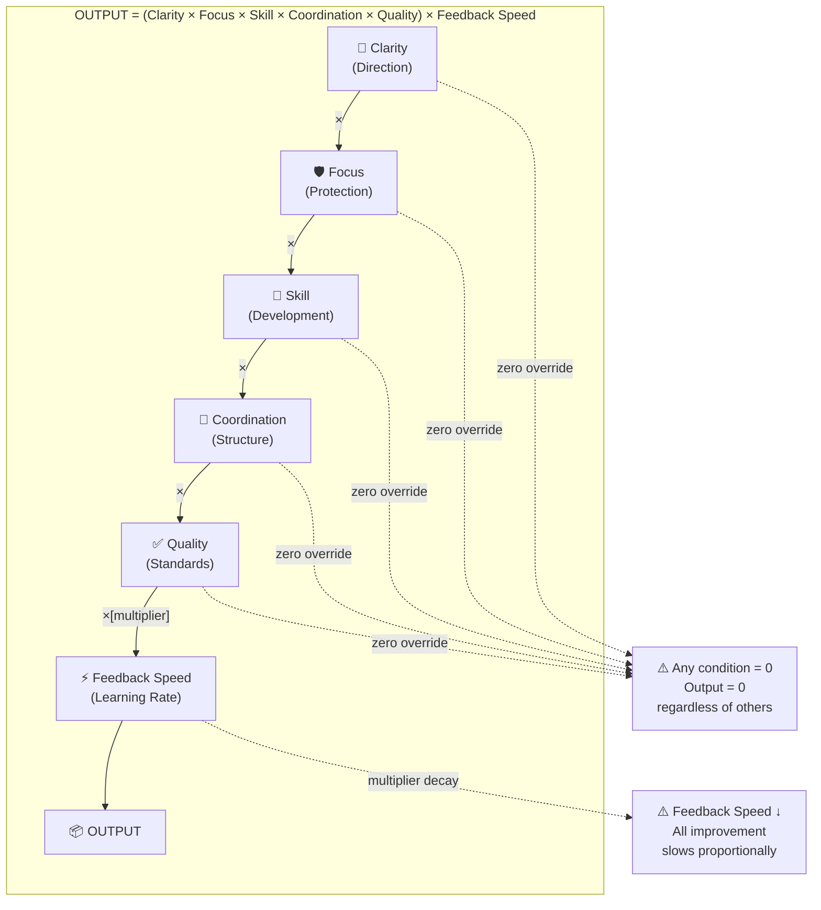
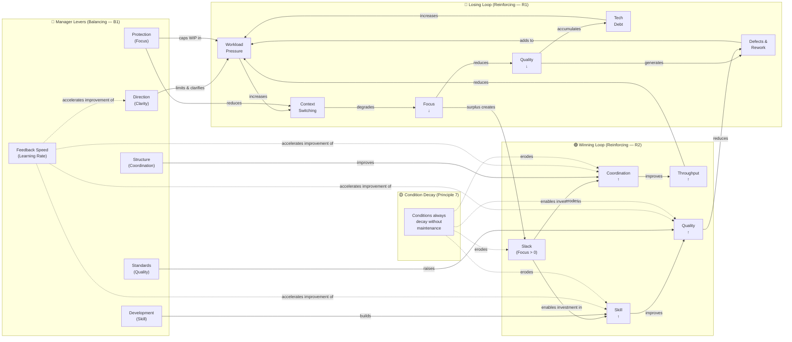
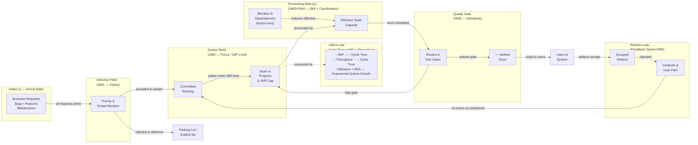
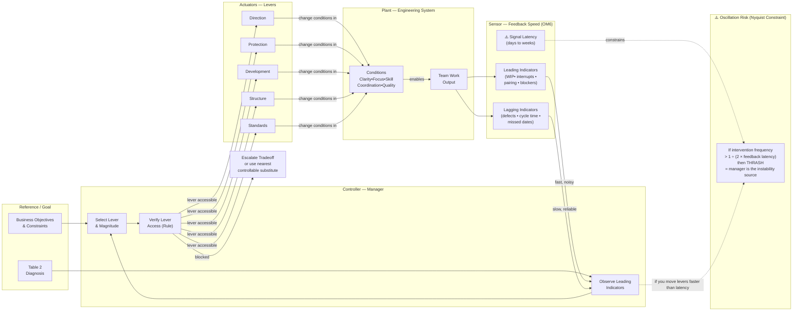
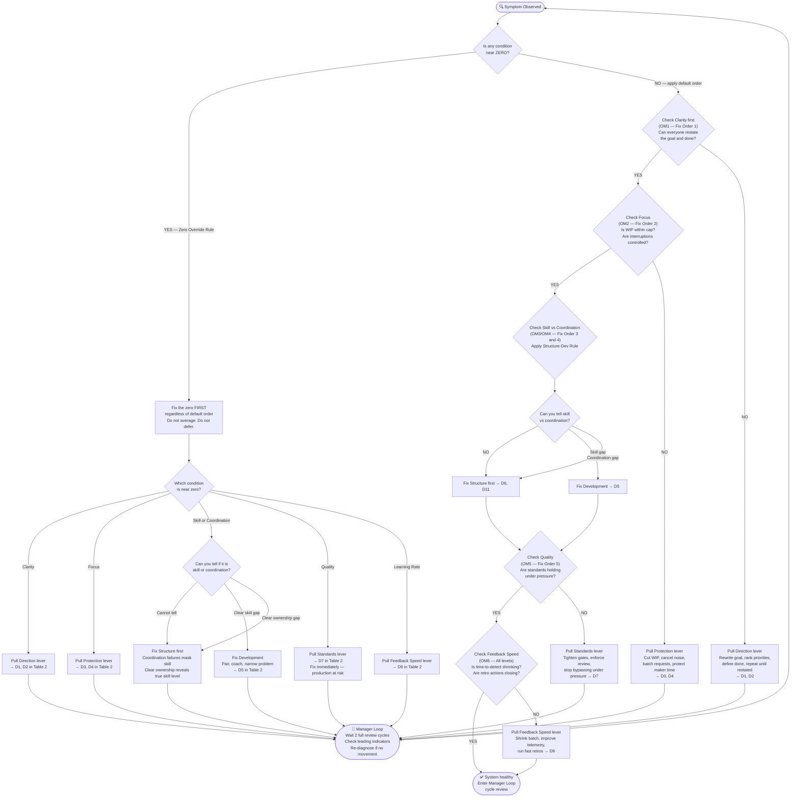
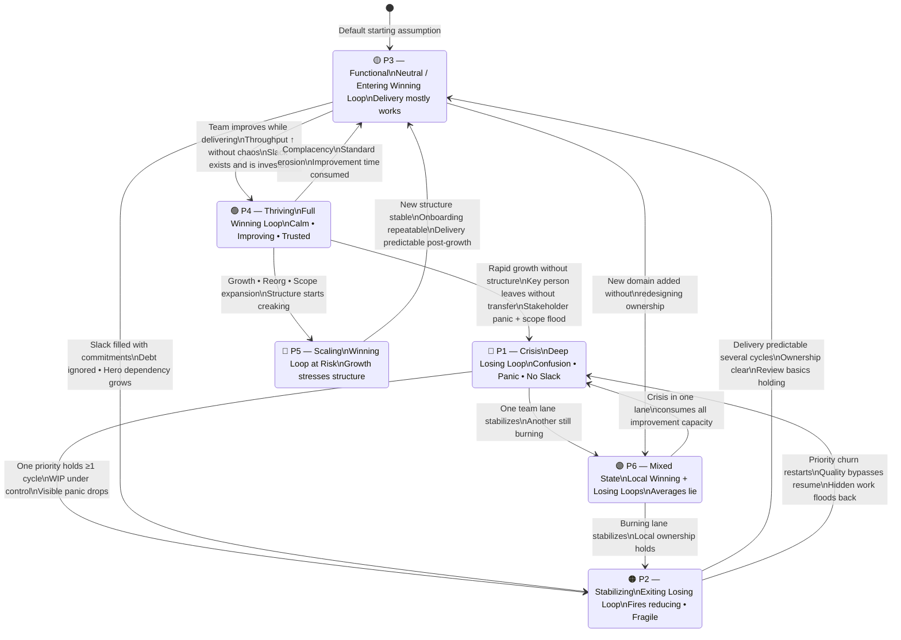
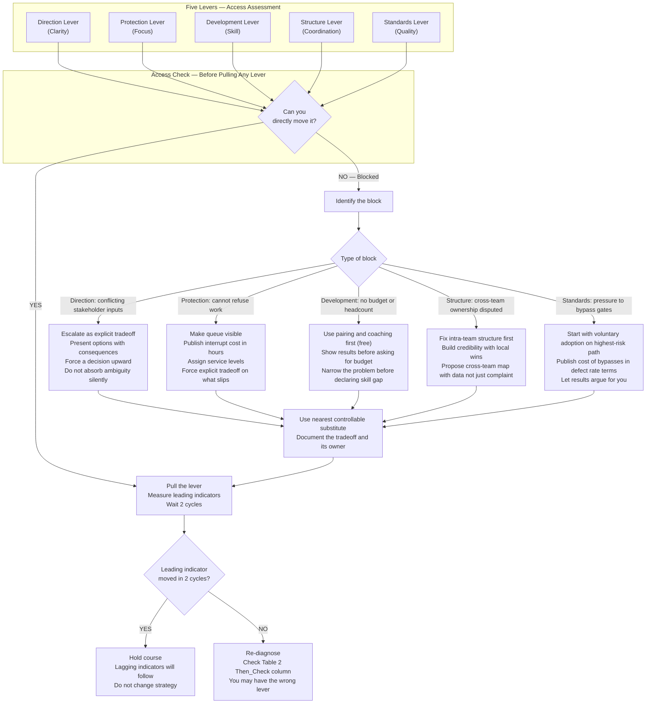
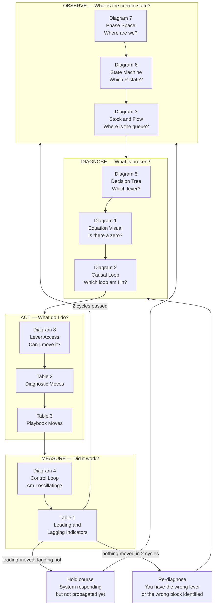

I'll design a comprehensive, deeply integrated set of diagrams that cover every dimension of the framework. Let me think through what's genuinely missing and what would add the most explanatory power.

---

## The Complete Diagram Architecture

Here is the full set of nine diagrams, each covering a distinct explanatory layer, with no overlap and no gaps.

---

## Diagram 1 — The Master Equation as a Visual Identity

Before any dynamics, the equation itself needs a visual form that makes the multiplicative structure and the zero-override rule immediately obvious.



**What this diagram teaches:** The multiplicative structure is the core insight. A team with perfect skill, coordination, and quality but zero clarity still produces zero. Managers who invest in only one or two conditions while ignoring a near-zero elsewhere are solving the wrong problem. The zero-override rule is not a policy preference — it is arithmetic.

---

## Diagram 2 — The Full Causal Loop Diagram (Topology of the System)

This is the organizational physics diagram. It must show both loops, all manager levers, and the decay dynamics from Principle 7.



**What this diagram teaches:**
- The losing loop is self-accelerating. Once workload exceeds a threshold, it degrades focus, which degrades quality, which generates more rework, which increases workload further. No amount of working harder breaks this — only the manager's balancing levers can.
- The winning loop is equally self-reinforcing. Slack creates investment capacity, which raises skill and coordination, which raises throughput and quality, which reduces workload, which creates more slack.
- Condition decay (dashed yellow) means the winning loop is not self-sustaining without maintenance. This is why "don't get complacent" is in every P4 row.

---

## Diagram 3 — Stock and Flow / Queuing Physics (Little's Law Made Visible)

This is the throughput diagram. It operationalizes Little's Law: Cycle Time = WIP ÷ Throughput.



**What this diagram teaches:**
- There are two flows: the intended forward flow (request → done → ship) and the rework loop (escaped defect → incident → back into backlog). Low Standards widen the rework loop. Slow Feedback Speed delays its detection.
- WIP is a physical stock with a physical cap. The manager's job at Protection is literally to enforce that cap. When utilization exceeds roughly 85%, queuing theory predicts non-linear cycle time growth — the queue explodes disproportionately relative to the utilization increase.
- The parking lot / explicit no is as important as the yes. Direction is not just picking what to do — it is explicitly declining what not to do.

---

## Diagram 4 — Closed-Loop Control System (Manager Oscillation and the Nyquist Constraint)

This is the control-engineering view of the Manager's Own Loop.



**What this diagram teaches:**
- The sensor (Feedback Speed) has inherent latency. Leading indicators arrive faster but are noisier. Lagging indicators are reliable but slow.
- The Nyquist constraint from control theory says: if you intervene faster than the signal propagates, you are feeding noise back into the system. This is the formal reason for "give any intervention at least 2 full cycles before judging it."
- The lever-access check is an explicit decision gate, not an afterthought. Many managers pull levers they cannot move and wonder why nothing changes.

---

## Diagram 5 — The Fix-Order Decision Tree (Diagnostic Flowchart)

This operationalizes Table 2 as an executable decision tree, including the zero-override rule and the structure-vs-development disambiguation.



**What this diagram teaches:** This is the complete executable diagnostic logic from Table 2, made navigable. The zero-override and structure-vs-development rules are integrated as decision gates, not footnotes. Importantly, the manager loop feeds back into the start — this is not a one-time checklist but a recurring cycle.

---

## Diagram 6 — Team State Machine (Playbook Navigation)

This is the state transition diagram from Table 3, showing all five states, transition conditions, and regression triggers.



**What this diagram teaches:**
- States are not linear. You can regress from P4 back to P1 in a single bad month if growth or stakeholder pressure is uncontrolled.
- P6 is not between other states — it is a genuinely distinct configuration where two loops run simultaneously. The mixed-state rule exists precisely because P6 is invisible to averaged metrics.
- Regression triggers are shown as backward transitions. They are not rare edge cases — they are the default outcome if maintenance stops.

---

## Diagram 7 — The Phase Space Diagram (Trajectory Visualization)

This is the fourth diagram suggested in the synthesis — plotting the team's movement through focus-quality space over time, making pathologies visible as trajectories rather than point-in-time readings.

```mermaid
quadrantChart
    title Team Phase Space — Focus (WIP Discipline) vs Quality (Escaped Defect Rate)
    x-axis Low Focus (WIP chaos) --> High Focus (WIP disciplined)
    y-axis Low Quality (defects escaping) --> High Quality (defects caught)
    quadrant-1 Hero Culture (High Quality, Low Focus)
    quadrant-2 Thriving P4 (High Focus, High Quality)
    quadrant-3 Crisis P1 (Low Focus, Low Quality)
    quadrant-4 Rushing (High Focus, Low Quality — debt accumulating)
    Team in Crisis: [0.1, 0.1]
    Team Stabilizing: [0.3, 0.25]
    Team Functional: [0.55, 0.55]
    Team Thriving: [0.8, 0.85]
    Hero Culture Trap: [0.2, 0.75]
    Rushing Trap: [0.7, 0.2]
    Scaling Stress Point: [0.6, 0.6]
```

**The four quadrant interpretations:**

| Quadrant | State | Mechanism | Intervention |
|---|---|---|---|
| Lower-left | Crisis (P1) | No focus, no quality — chaos amplifies chaos | Direction + Protection first |
| Lower-right | Rushing trap | Disciplined WIP but standards bypassed under pressure | Standards lever — non-negotiable quality |
| Upper-left | Hero culture | High quality maintained by individual heroics, not system | Structure + Protection — ownership before heroics |
| Upper-right | Thriving (P4) | System maintains quality with disciplined flow | Protect and invest — winning loop is running |

**Trajectory rules:**
- Healthy trajectory: Crisis → Stabilizing moves diagonally right and up (focus improves before quality catches up, with a slight lag).
- Rushing trap trajectory: teams under deadline pressure move right but drop sharply in quality. This looks like improvement on cycle time metrics while lagging quality indicators worsen.
- Hero culture trajectory: quality is maintained by one person working enormous hours. Focus is low because WIP is not capped — one hero absorbs the overflow. Remove the hero and the team drops to Crisis instantly. This is the bus-factor failure mode.

---

## Diagram 8 — The Lever Access and Escalation Map

This operationalizes the Lever-Access Rule from the foundation — the diagram that no other framework includes but that every practicing manager needs.



**What this diagram teaches:** The most common failure mode in management is pulling a lever you cannot move and interpreting the lack of movement as evidence the problem is unsolvable or the team is at fault. The lever-access check makes this explicit. The escalation paths turn a blocked manager from someone who is stuck into someone who is surfacing a tradeoff that belongs at a higher level.

---

## Diagram 9 — The Complete Temporal Loop (How All Diagrams Connect Over Time)

This is the meta-diagram — showing how all eight preceding diagrams relate to each other as a single operating cycle.



**What this diagram teaches:** The framework is not a checklist read once. It is a control cycle: observe state, diagnose condition, verify lever access, act, measure, wait for propagation, re-diagnose if needed. The three diagnostic diagrams (7, 6, 3) feed the diagnostic tools (5, 1, 2), which feed the action tools (8, plus tables), which feed the measurement tools (4, plus indicators), which feed back into observation. This is why the Manager's Own Loop is in the foundation, not just in Table 3.

---

## Summary: The Nine Diagrams and What Each One Covers

| # | Diagram | Primary Table Mapping | Core Question Answered |
|---|---|---|---|
| 1 | Master Equation Visual | Foundation | Why does one zero kill everything? |
| 2 | Causal Loop Diagram | Table 3 (Playbook states) | Which loop am I in and why? |
| 3 | Stock and Flow | Table 1 OM1–OM6 | Where is work physically stuck? |
| 4 | Closed-Loop Control | Foundation Manager Loop | Am I oscillating or improving? |
| 5 | Fix-Order Decision Tree | Table 2 (all rows) | Which lever do I pull first? |
| 6 | Team State Machine | Table 3 (all P-states) | Where are we and where might we go? |
| 7 | Phase Space | Table 3 (trajectories) | Are we moving in the right direction? |
| 8 | Lever Access Map | Foundation Lever-Access Rule | Can I actually move this lever? |
| 9 | Complete Temporal Loop | All tables integrated | How do all the pieces connect over time? |

These nine diagrams are complete. Together they cover every structural rule in the foundation, every row in all three tables, and every dynamic the framework describes — without redundancy and without gaps.