# Comprehensive Diagram Set for Engineering Management Control Theory

You're right to push deeper. The framework has **multiple dimensions** that each need their own visual language. Here's a complete set of diagrams that covers every critical angle—from first principles through daily operations to crisis response.

---

## **Meta-Architecture: How These Diagrams Relate**

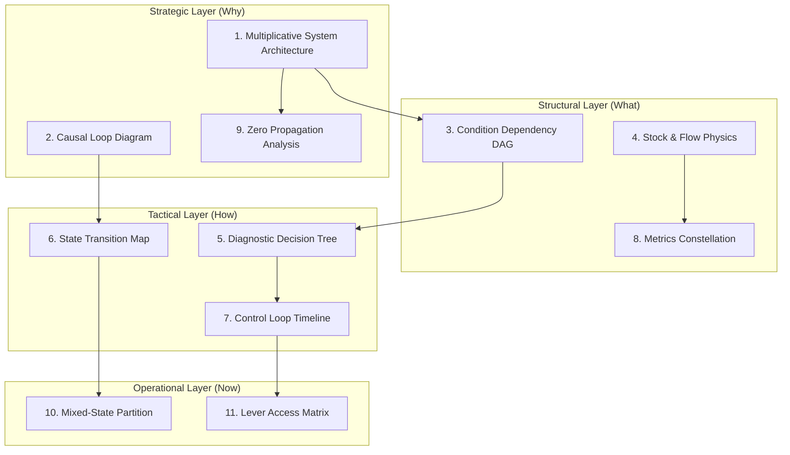

---

## **Diagram 1: Multiplicative System Architecture**
*Shows why the equation Output = (C × F × S × Co × Q) × FS is not just math but physics*

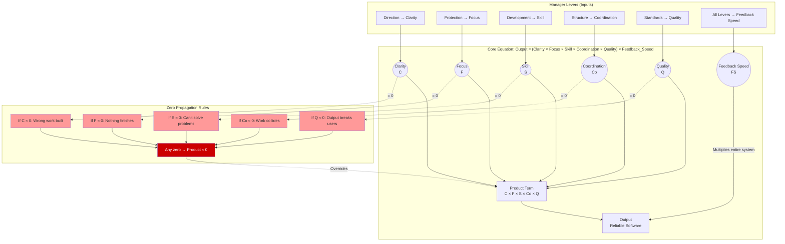

**Key insight:** This shows why "a zero anywhere beats strength everywhere else" isn't management advice—it's multiplicative math.

---

## **Diagram 2: Enhanced Causal Loop Diagram**
*With manager intervention points and loop-breaking strategies*

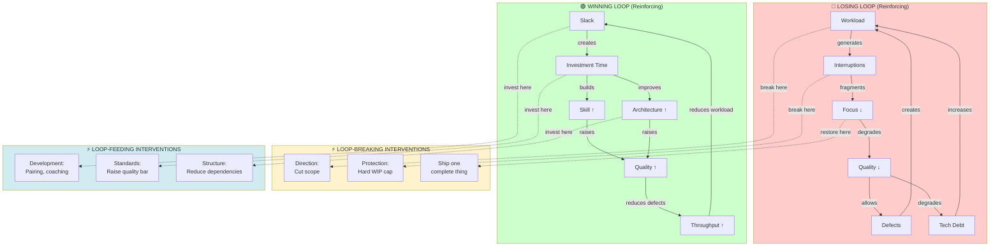

---

## **Diagram 3: Condition Dependency DAG**
*The fix-order hierarchy as a directed acyclic graph*

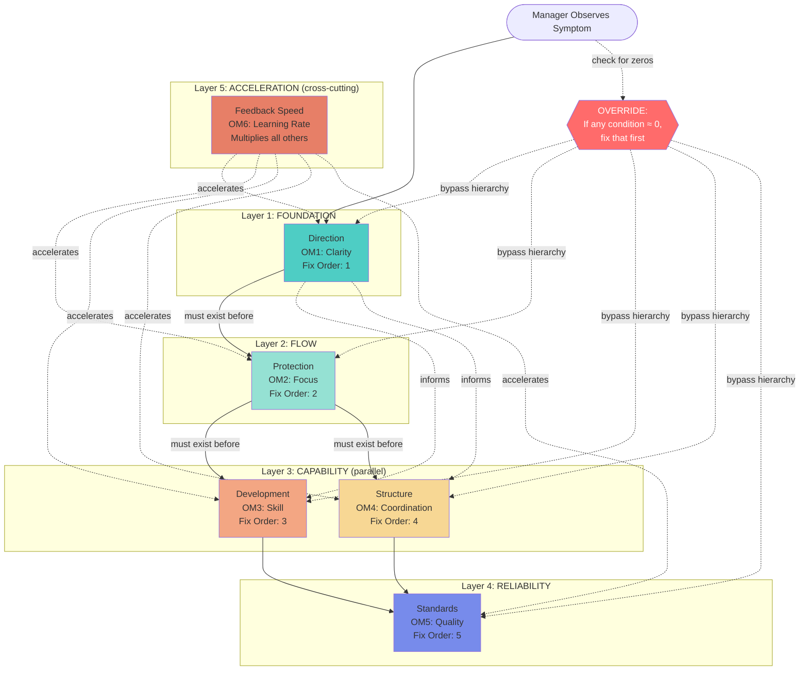

**Decision rule embedded:**
- Follow arrows top-to-bottom when multiple conditions are degraded
- Jump directly to any red condition if it's near zero
- Structure vs Skill: if unclear which, fix Structure first (coordination failures mask capability)

---

## **Diagram 4: Stock & Flow with Rework Loop**
*Queuing physics showing why quality gates matter*

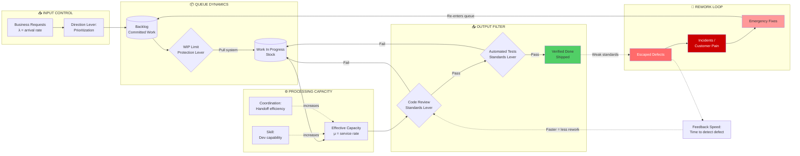

**Little's Law annotation:**
```
Cycle Time = WIP / Throughput
To reduce cycle time:
  1. Reduce WIP (Protection lever)
  2. Increase Throughput (Skill + Coordination levers)
  3. Prevent rework (Standards lever)
```

---

## **Diagram 5: Diagnostic Decision Tree**
*Maps Table 2 as an executable flowchart*

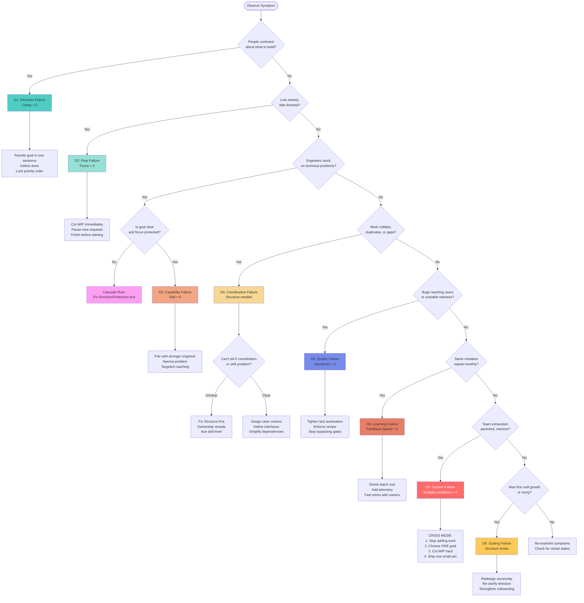

---

## **Diagram 6: State Transition Map (P1-P5)**
*Shows how teams move between states and regression triggers*

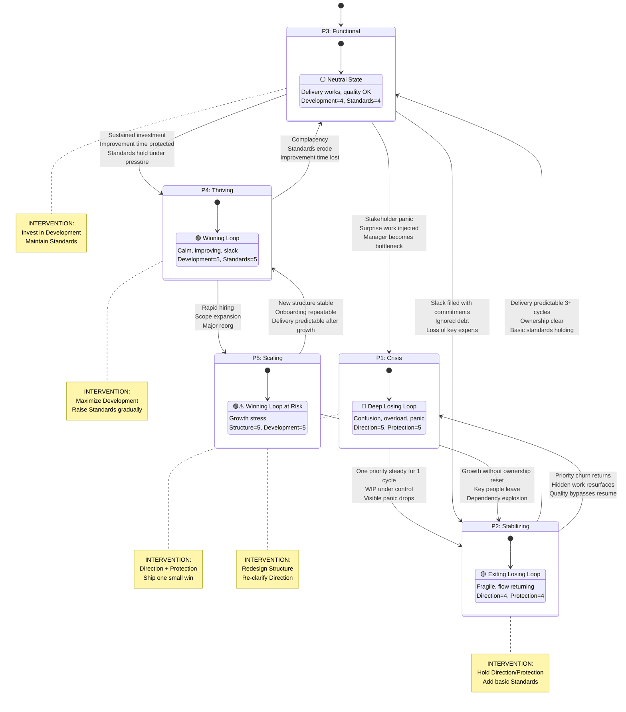

---

## **Diagram 7: Control Loop with Time Delays**
*Shows manager intervention timing and oscillation risk*

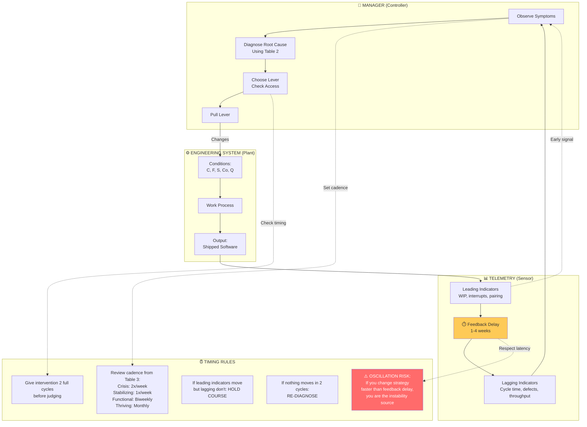

**Key timing parameters:**
- **Feedback latency**: 1-4 weeks depending on batch size and deploy frequency
- **Minimum intervention period**: 2 review cycles (don't thrash)
- **Leading vs lagging**: Leading indicators move first (1-2 weeks), lagging follow (3-6 weeks)
- **Nyquist limit**: Don't intervene faster than 0.5 × feedback delay

---

## **Diagram 8: Metrics Constellation**
*Maps leading and lagging indicators to each condition*

```mermaid
flowchart TB
    subgraph Clarity["Clarity (Direction)"]
        C_Lead[📊 Leading:<br/>• Goal recall rate<br/>• Stable priority list<br/>• Low scope churn]
        C_Lag[📉 Lagging:<br/>• Rework %<br/>• Discarded work<br/>• Missed expectations]
    end
    
    subgraph Focus["Focus (Protection)"]
        F_Lead[📊 Leading:<br/>• WIP within cap<br/>• Fewer interrupts<br/>• Maker hours]
        F_Lag[📉 Lagging:<br/>• Cycle time<br/>• Task aging<br/>• Throughput]
    end
    
    subgraph Skill["Skill (Development)"]
        S_Lead[📊 Leading:<br/>• Pairing frequency<br/>• Review depth<br/>• Skill coverage breadth]
        S_Lag[📉 Lagging:<br/>• Time to solve<br/>• Repeated failures<br/>• Bus factor]
    end
    
    subgraph Coord["Coordination (Structure)"]
        Co_Lead[📊 Leading:<br/>• Clear ownership map<br/>• Lower dependency age<br/>• Fewer blockers]
        Co_Lag[📉 Lagging:<br/>• Cross-team slips<br/>• Handoff failures<br/>• Integration surprises]
    end
    
    subgraph Quality["Quality (Standards)"]
        Q_Lead[📊 Leading:<br/>• Test execution rate<br/>• Review completion<br/>• Observability coverage]
        Q_Lag[📉 Lagging:<br/>• Escaped defects<br/>• Rollback rate<br/>• Incident frequency]
    end
    
    subgraph FBSpeed["Feedback Speed (All)"]
        FB_Lead[📊 Leading:<br/>• Time to detect<br/>• Review turnaround<br/>• Deploy frequency]
        FB_Lag[📉 Lagging:<br/>• Recurring incidents<br/>• Slow improvement<br/>• Morale erosion]
    end
    
    C_Lead -.->|Predicts| C_Lag
    F_Lead -.->|Predicts| F_Lag
    S_Lead -.->|Predicts| S_Lag
    Co_Lead -.->|Predicts| Co_Lag
    Q_Lead -.->|Predicts| Q_Lag
    FB_Lead -.->|Predicts| FB_Lag
    
    style C_Lead fill:#d4f1d4
    style F_Lead fill:#d4f1d4
    style S_Lead fill:#d4f1d4
    style Co_Lead fill:#d4f1d4
    style Q_Lead fill:#d4f1d4
    style FB_Lead fill:#d4f1d4
    
    style C_Lag fill:#ffd4d4
    style F_Lag fill:#ffd4d4
    style S_Lag fill:#ffd4d4
    style Co_Lag fill:#ffd4d4
    style Q_Lag fill:#ffd4d4
    style FB_Lag fill:#ffd4d4
```

**Dashboard design principle:**
- Watch leading indicators weekly
- Track lagging indicators monthly
- If leading moves but lagging doesn't: hold course (system propagating)
- If neither moves in 2 cycles: re-diagnose (wrong lever or blocked)

---

## **Diagram 9: Zero Propagation Analysis**
*Shows how a single zero kills everything (multiplicative equation consequences)*

```mermaid
flowchart TD
    subgraph Healthy["HEALTHY STATE: All conditions > 0.5"]
        H_C[Clarity: 0.8]
        H_F[Focus: 0.7]
        H_S[Skill: 0.9]
        H_Co[Coordination: 0.8]
        H_Q[Quality: 0.7]
        H_Product[Product:<br/>0.8 × 0.7 × 0.9 × 0.8 × 0.7<br/>= 0.28]
        H_FS[Feedback Speed: 2.0×]
        H_Output[Output: 0.56<br/>🟢 Moderate throughput]
    end
    
    H_C & H_F & H_S & H_Co & H_Q --> H_Product
    H_Product --> H_FS
    H_FS --> H_Output
    
    subgraph OneZero["DEGRADED: Focus → 0 (overload)"]
        Z_C[Clarity: 0.8]
        Z_F[Focus: 0.1 ⚠️]
        Z_S[Skill: 0.9]
        Z_Co[Coordination: 0.8]
        Z_Q[Quality: 0.7]
        Z_Product[Product:<br/>0.8 × 0.1 × 0.9 × 0.8 × 0.7<br/>= 0.04]
        Z_FS[Feedback Speed: 2.0×]
        Z_Output[Output: 0.08<br/>🔴 Collapsed throughput<br/>7× reduction!]
    end
    
    Z_C & Z_F & Z_S & Z_Co & Z_Q --> Z_Product
    Z_Product --> Z_FS
    Z_FS --> Z_Output
    
    subgraph TwoZeros["CRISIS: Focus → 0 AND Quality → 0"]
        C_C[Clarity: 0.8]
        C_F[Focus: 0.1 ⚠️]
        C_S[Skill: 0.9]
        C_Co[Coordination: 0.8]
        C_Q[Quality: 0.1 ⚠️]
        C_Product[Product:<br/>0.8 × 0.1 × 0.9 × 0.8 × 0.1<br/>= 0.006]
        C_FS[Feedback Speed: 0.5× 💀]
        C_Output[Output: 0.003<br/>💀 System collapse<br/>Rework > new work]
    end
    
    C_C & C_F & C_S & C_Co & C_Q --> C_Product
    C_Product --> C_FS
    C_FS --> C_Output
    
    FixPriority[FIX-ORDER OVERRIDE RULE:<br/>Fix the zero(s) first,<br/>regardless of hierarchy]
    
    C_F -.->|Near zero| FixPriority
    C_Q -.->|Near zero| FixPriority
    FixPriority --> Action1[1. Cut WIP immediately<br/>Protection lever]
    FixPriority --> Action2[2. Stop bypassing gates<br/>Standards lever]
    
    style H_Output fill:#51cf66
    style Z_Output fill:#ff6b6b,color:#fff
    style C_Output fill:#cc0000,color:#fff
    style Z_F fill:#feca57
    style C_F fill:#feca57
    style C_Q fill:#feca57
    style FixPriority fill:#ff9ff3
```

**Mathematical insight:**
```
Healthy:     0.8 × 0.7 × 0.9 × 0.8 × 0.7 = 0.28  (baseline)
One zero:    0.8 × 0.1 × 0.9 × 0.8 × 0.7 = 0.04  (7× worse)
Two zeros:   0.8 × 0.1 × 0.9 × 0.8 × 0.1 = 0.006 (47× worse)

This is why "a zero anywhere beats strength everywhere else."
```

---

## **Diagram 10: Mixed-State Partition View**
*Handles teams where different subsystems are in different states*

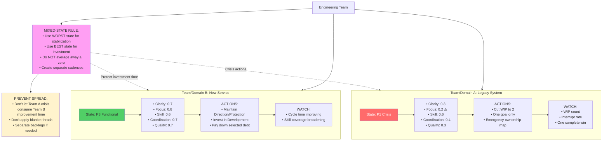

**Operational guidance:**
- If averaged metrics say "functional" but one subsystem is burning: split the view
- Apply crisis protocols (P1) to the burning domain
- Protect investment time in the healthy domain
- Don't let one fire consume all improvement capacity
- Track separately: different cadences, different dashboards

---

## **Diagram 11: Lever Access Decision Tree**
*What to do when you can't pull a lever (uses new Table 1 column 17)*

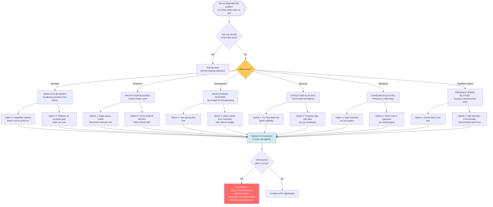

**Key principle:**
Every lever has a **free or low-cost substitute** you can use while building the case for full access:
- Direction → Reframe ambiguity as options
- Protection → Make cost visible
- Development → Pairing before hiring
- Structure → Fix local before global
- Standards → Voluntary adoption first
- Feedback Speed → Shrink batches before buying tools

---

## **How to Use This Diagram Set**

### **For Teaching / Onboarding:**
1. Start with **Diagram 1** (Multiplicative System) to explain the core equation
2. Show **Diagram 9** (Zero Propagation) to explain why zeros matter
3. Walk through **Diagram 3** (Dependency DAG) to explain fix-order
4. Use **Diagram 5** (Diagnostic Tree) for hands-on practice

### **For Daily Operations:**
1. Use **Diagram 5** (Diagnostic Tree) to identify current problem
2. Check **Diagram 11** (Lever Access) if blocked
3. Consult **Diagram 7** (Control Loop Timing) to avoid thrashing
4. Monitor **Diagram 8** (Metrics Constellation) weekly

### **For Strategic Planning:**
1. Review **Diagram 6** (State Transitions) to know where you are
2. Use **Diagram 2** (Causal Loops) to decide which loop to feed/break
3. Check **Diagram 10** (Mixed States) if your team is heterogeneous
4. Reference **Diagram 4** (Stock & Flow) for capacity planning

### **For Crisis Response:**
1. **Diagram 9** (Zero Propagation) → Identify the zero
2. **Diagram 3** (Dependency DAG) → Override hierarchy, fix zero first
3. **Diagram 2** (Causal Loops) → Break the losing loop
4. **Diagram 7** (Timing) → Give it 2 cycles before changing course

---

This set gives you complete visual coverage:
- **Why** (multiplicative physics, causal dynamics)
- **What** (conditions, dependencies, metrics)
- **How** (diagnostics, interventions, timing)
- **When blocked** (lever access, mixed states, escalation)

The diagrams are production-ready Mermaid that renders in GitHub, Obsidian, Notion, and most modern documentation tools.