# The Thermodynamics of Engineering Management: A Complete Visual Architecture

Let me think through every conceptual layer in this document and design diagrams that are genuinely irreplaceable — each one covering territory no other diagram touches.

---

## The Complete Diagram Set: Rationale First

The document operates across six distinct explanatory layers:

| Layer | What It Explains | Diagrams Needed |
|---|---|---|
| **Equation** | Multiplicative output, zero collapse | Master equation identity |
| **Topology** | Causal loops, winning/losing dynamics | Full CLD with decay |
| **Physics** | Queuing, Little's Law, utilization curves | Stock-flow + utilization curve |
| **Control** | Manager oscillation, Nyquist constraint | Closed-loop control diagram |
| **Diagnostic** | Symptom → condition → lever | Decision tree + phase space |
| **Temporal** | State transitions, trajectories, regression | State machine + playbook navigator |
| **Macro** | Fractal scaling to ecosystem level | Fractal scaling diagram |

---

## Diagram 1 — The Master Equation: Zero Collapse and Multiplier Structure

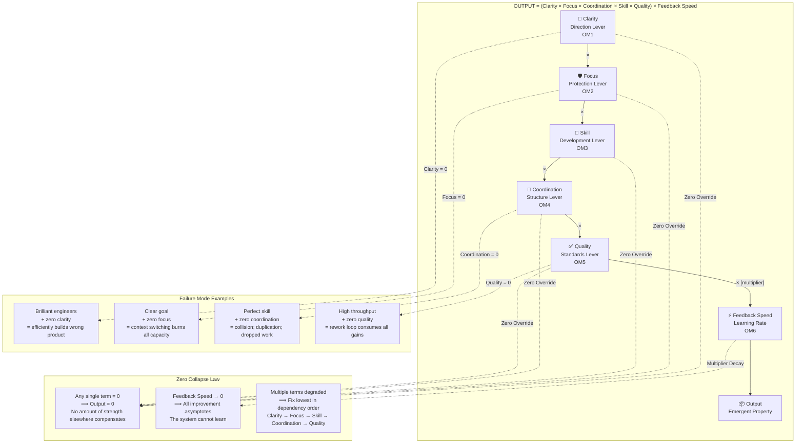

**Teaching point:** This diagram must be the first thing a new manager sees. The multiplicative structure is the entire framework's load-bearing premise. Every other diagram is an elaboration of why one of these terms goes to zero and what to do about it.

---

## Diagram 2 — The Full Socio-Technical Causal Loop Diagram

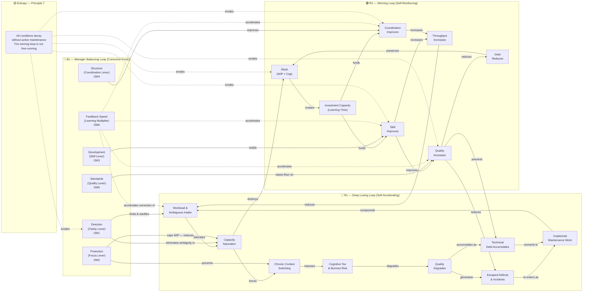

**Teaching point:** The losing loop cannot be halted by willpower. The system is functioning exactly as its structure dictates — this is the socio-technical design insight. Structural change (the manager's balancing levers) is the only thermodynamic solution. The decay arrows on the winning loop explain why "don't get complacent" is a thermodynamic requirement, not a motivational slogan.

---

## Diagram 3 — Stock and Flow: The Physics of Throughput (Little's Law Made Visible)

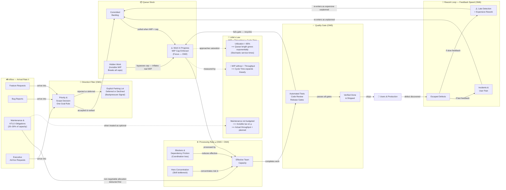

**Teaching point:** There are three hidden destroyers in this diagram that most managers never see: Hidden Work bypasses WIP caps making them meaningless; Maintenance obligations invisibly tax throughput when not explicitly budgeted; and the rework loop is two different feedback speeds — fast detection is cheap, slow detection is catastrophic. The utilization curve (LL2) explains why a team at 90% utilization feels ten times worse than one at 80%.

---

## Diagram 4 — The Utilization Curve: Why 85% Is the Physics Limit

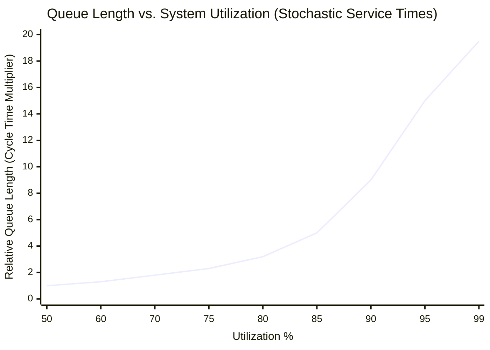

**Annotation layer (add as a table below the chart):**

| Utilization | Queue Behavior | Team Experience | Manager Action |
|---|---|---|---|
| 50–70% | Linear, manageable | Slack exists; learning happens | Invest in skill and architecture |
| 70–80% | Mild growth | Busy but finishing | Monitor WIP; protect improvement time |
| 80–85% | Accelerating | Fragile; one surprise breaks flow | Enforce WIP cap; reduce hidden work |
| 85–90% | Non-linear explosion | Everything urgent; nothing finishing | Pull Protection lever immediately |
| 90–95% | Near-infinite queue | Panic; context switching; burnout | Crisis state — Direction + Protection first |
| 95–99% | System breakdown | P1 Crisis; losing loop accelerating | Shed load; cut WIP; one goal only |

**Teaching point:** This is the most counterintuitive diagram in the set. Managers instinctively push utilization toward 100% as a measure of efficiency. Queuing theory proves this destroys throughput. The curve goes non-linear above 85% for any system with variable service times — which every software team has. This is why "finish before starting" is physics, not preference.

---

## Diagram 5 — Closed-Loop Control System: Manager Oscillation and the Nyquist Constraint

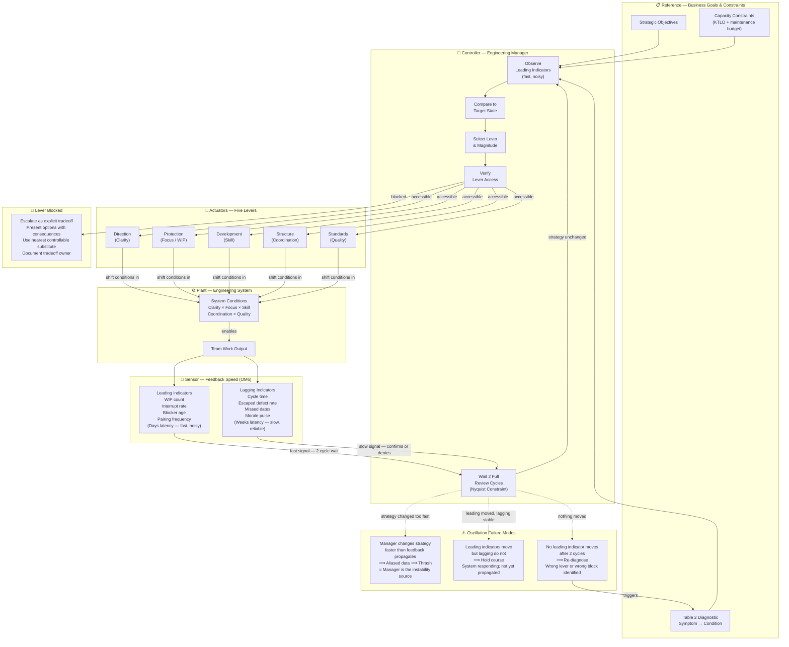

**Teaching point:** The Nyquist constraint is the formal name for the most common management failure mode — changing strategy before the previous change has had time to propagate. The sensor latency difference between leading and lagging indicators is why the rule "hold course when leading indicators move but lagging do not" is not patience, it is physics.

---

## Diagram 6 — The Complete Diagnostic Decision Tree (Table 2 as Executable Logic)

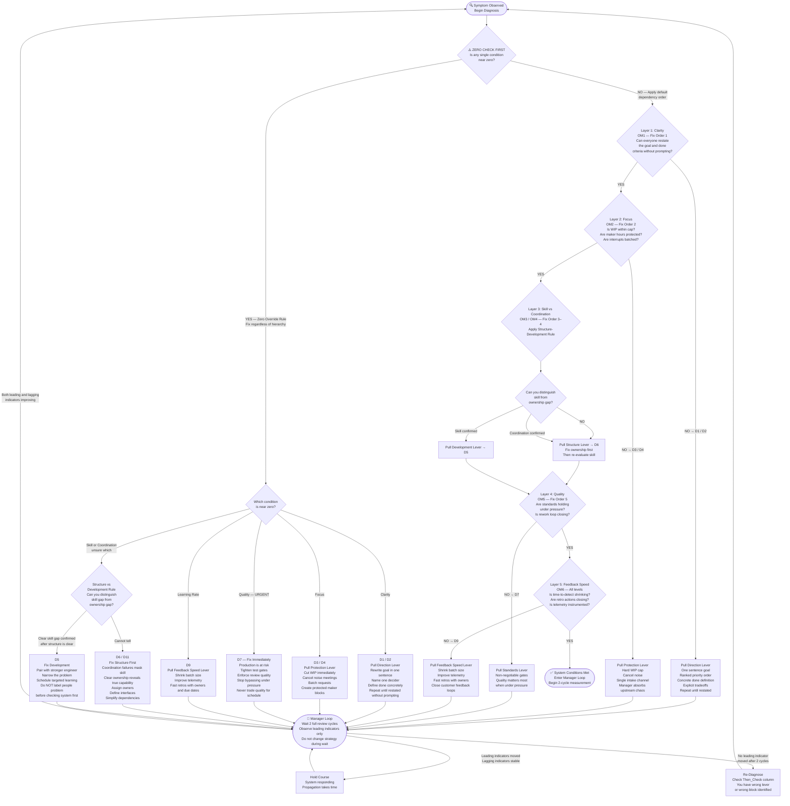

**Teaching point:** The zero-check is non-negotiable and must precede all other diagnostic steps. The structure-vs-development disambiguation is a genuine decision gate, not a footnote. The manager loop feeds back into the start — this is not a checklist; it is a repeating control cycle with an explicit prohibition on intervening faster than feedback latency allows.

---

## Diagram 7 — Team State Machine with Regression Paths (Table 3 Navigation)

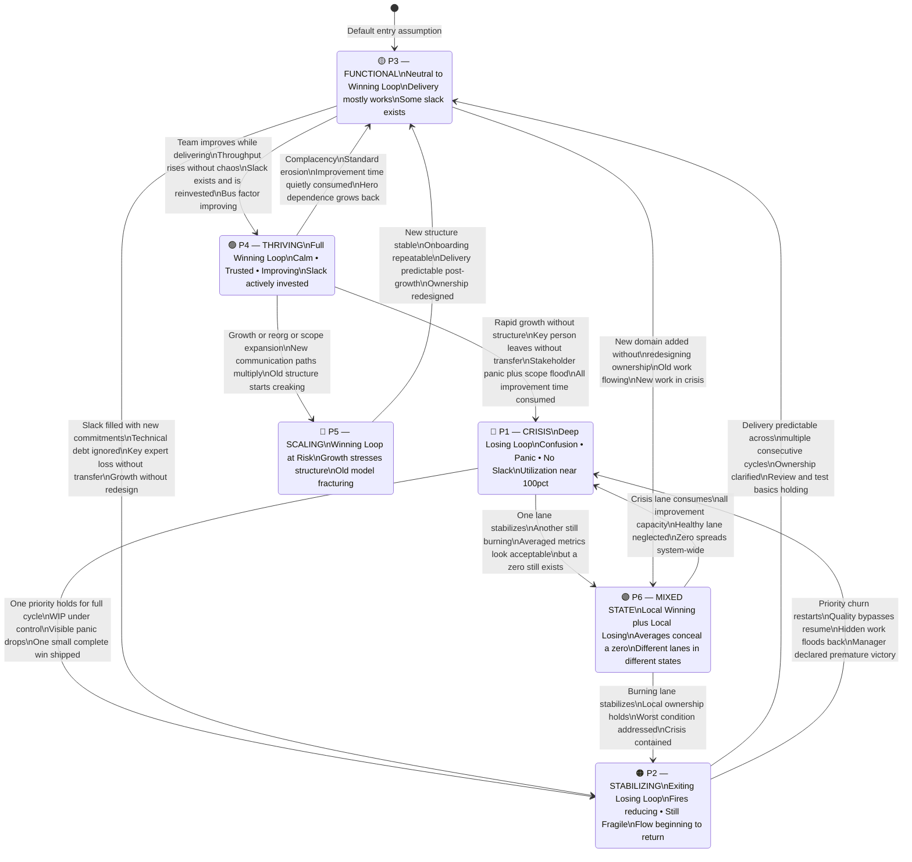

**Teaching point:** Three non-obvious dynamics this diagram makes visible: First, P4 → P1 is a direct path — thriving teams collapse fast when growth hits without structural redesign. Second, P6 (Mixed State) is not between other states; it is a parallel configuration invisible to averaged metrics. Third, every upward transition has a symmetric regression path, illustrating why condition maintenance (Principle 7) is not optional.

---

## Diagram 8 — The Phase Space Diagram (Trajectory Visualization)

```mermaid
quadrantChart
    title Engineering Team Phase Space — WIP Discipline (Focus) vs. Defect Containment (Quality)
    x-axis Low WIP Discipline (Chaos) --> High WIP Discipline (Focused Flow)
    y-axis Low Quality (Defects Escaping) --> High Quality (Defects Contained)
    quadrant-1 Hero Culture Trap
    quadrant-2 Thriving — P4
    quadrant-3 Crisis — P1
    quadrant-4 Rushing Trap (Debt Accumulating)
    Crisis P1: [0.08, 0.08]
    Stabilizing P2: [0.28, 0.22]
    Functional P3: [0.55, 0.52]
    Thriving P4: [0.82, 0.85]
    Scaling Stress P5: [0.62, 0.58]
    Hero Culture: [0.18, 0.78]
    Deadline Rush: [0.72, 0.18]
    Mixed State P6a Healthy Lane: [0.70, 0.72]
    Mixed State P6b Burning Lane: [0.12, 0.15]
```

**The four quadrant failure modes:**

| Quadrant | Name | Mechanism | Hidden Danger | Intervention |
|---|---|---|---|---|
| Lower-left | Crisis (P1) | No focus + no quality — chaos amplifies chaos through the losing loop | Every metric is bad; diagnosis is easy | Direction + Protection immediately |
| Lower-right | Rushing Trap | WIP disciplined but standards bypassed under deadline pressure | Cycle time looks good; debt accumulates invisibly; future velocity collapses | Standards lever — non-negotiable; anti-pattern 7 |
| Upper-left | Hero Culture | One person maintains quality for the team; bus factor = 1 | Remove the hero and the team drops to crisis overnight | Structure + Development; broaden ownership; reduce hero dependence |
| Upper-right | Thriving (P4) | System maintains quality with disciplined flow | Complacency; decay begins silently | Protect and invest; raise standards one notch per cycle |

**Trajectory rules for the phase space:**

- **Healthy crisis recovery:** Moves diagonally toward upper-right, with Focus improving slightly before Quality catches up (one to two cycle lag).
- **Rushing trap trajectory:** Moves right (Focus improves) then drops sharply in quality (standards bypassed). Looks like improvement on WIP metrics while escaped defect rate worsens. This is the most dangerous invisible path.
- **Hero culture trajectory:** Quality stays high while Focus stays low. Sustainable only as long as the hero remains. Appears fine in metrics until it catastrophically isn't.
- **Scaling stress:** The team moves from P4 toward the center as coordination overhead increases — quality and WIP discipline both degrade under growth pressure until structure is redesigned.

---

## Diagram 9 — The Lever Access and Escalation Map

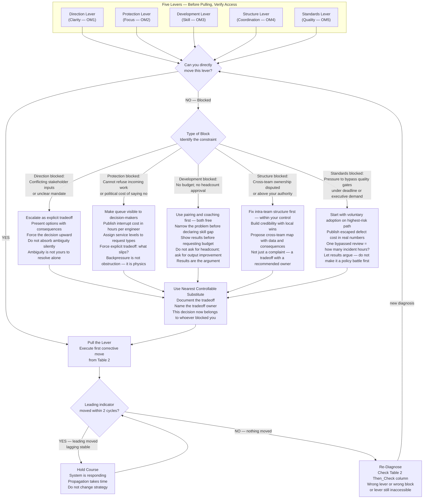

**Teaching point:** The single most common invisible management failure is pulling a lever you cannot move and interpreting the silence as evidence that the system is broken or the team is at fault. The escalation paths are equally important — they convert a blocked manager from someone who is stuck into someone who is surfacing a tradeoff that belongs at a higher level. The final step — naming the tradeoff owner — is critical. If you cannot move the lever and you do not name the owner, the problem has no home.

---

## Diagram 10 — The Fractal Scaling Diagram: From Team to Ecosystem

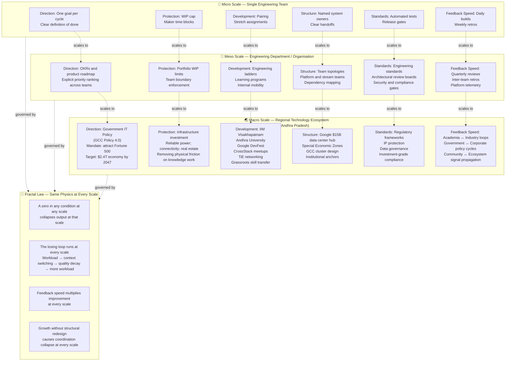

**Teaching point:** The Visakhapatnam example in the document is not decoration — it proves the framework is not domain-specific. Government policy is Direction at ecosystem scale. Physical infrastructure is Structure and Protection. Developer communities and universities are Development and Feedback Speed. The losing loop runs at every scale: when regional infrastructure is chaotic (Protection = 0), no amount of brilliant engineers produces sustained output. When government policy is ambiguous (Clarity = 0), capital flows to regions with clearer Direction.

---

## Diagram 11 — The Anti-Pattern Map: Logical Fallacies as System Failures

```mermaid
flowchart TD
    subgraph AP["Executive Anti-Patterns — Each Maps to a Specific System Failure"]

        AP1["❌ Anti-Pattern 1\nCommand focus through pressure\n'Just focus — stop getting distracted'"]
        AP1_R["Root Cause\nFocus is a system property\nContext switching is forced by structure\nnot chosen by individuals\nCascade Rule: check system before people"]

        AP2["❌ Anti-Pattern 2\nLabel poor performance as people failure\nbefore checking system conditions"]
        AP2_R["Root Cause\nSame person performs differently\nin good vs. bad conditions\nA smart person in a chaotic system\nlooks incompetent\nApply Cascade Rule — check N-1 first"]

        AP3["❌ Anti-Pattern 3\nAdd more detail to clarify a bad goal\nWrite longer PRDs; add more tickets"]
        AP3_R["Root Cause\nClarity comes from eliminating ambiguity\nand ranking tradeoffs explicitly\nNot from volume of documentation\nMore detail on a wrong goal = wrong goal faster"]

        AP4["❌ Anti-Pattern 4\nAdd process to fix coordination\n'We need a new meeting; a new ticket type'"]
        AP4_R["Root Cause\nProcess without ownership\n= bureaucracy without accountability\nOwnership must precede process\nFix structure first; add process second"]

        AP5["❌ Anti-Pattern 5\nRelax quality standards under deadline pressure\n'Skip review just this once to ship faster'"]
        AP5_R["Root Cause\nQuality matters most under pressure\nBypassing gates injects technical debt\nDebt compounds and guarantees future delays\nThe rework loop is more expensive than the review"]

        AP6["❌ Anti-Pattern 6\nChange strategy every week\n'We need to be agile; priorities shift'"]
        AP6_R["Root Cause\nNyquist constraint violated\nManager is acting on aliased — lagged — data\nConstant reprioritization induces thrash\nThe fastest way to go faster is to stop thrashing"]

        AP7["❌ Anti-Pattern 7\nRun surveys without implementing fixes\n'We care about your feedback'"]
        AP7_R["Root Cause\nBroken control loop\nTelemetry without corrective action\nproves the system cannot respond to its own signals\nCynicism compounds — trust erodes faster than it builds"]

        AP8["❌ Anti-Pattern 8\nAssume stable systems maintain themselves\n'The team is in a good place now'"]
        AP8_R["Root Cause\nConditions decay without maintenance\n(Principle 7 — Entropy)\nThe winning loop is not self-sustaining\nComplacency is a universal regression trigger"]

        AP9["❌ Anti-Pattern 9\nWrite code as manager to unblock the team\n'I will just fix this myself'"]
        AP9_R["Root Cause\nYour code = one feature\nSystem tuning = everyone faster\nManagerial heroics mask system failures\nand prevent the real lever from being pulled"]

        AP10["❌ Anti-Pattern 10\nGrant one quality exception and move on\n'Just this once given the circumstances'"]
        AP10_R["Root Cause\nExceptions become the new baseline\nCondition standards decay automatically\nOne exception establishes a lower permanent floor\nAnti-pattern 5 and 8 compound here"]
    end

    AP1 --> AP1_R
    AP2 --> AP2_R
    AP3 --> AP3_R
    AP4 --> AP4_R
    AP5 --> AP5_R
    AP6 --> AP6_R
    AP7 --> AP7_R
    AP8 --> AP8_R
    AP9 --> AP9_R
    AP10 --> AP10_R
```

---

## Diagram 12 — The Complete Temporal Integration Loop (How All Eleven Diagrams Connect)

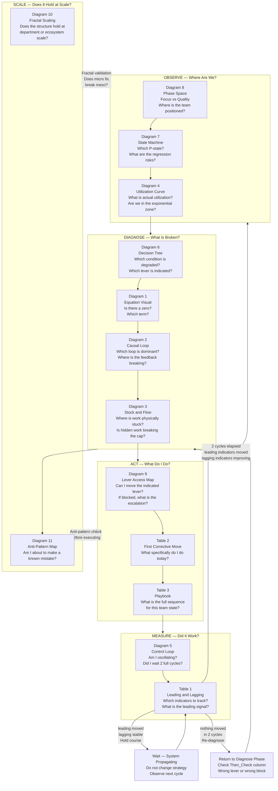

---

## Summary: The Complete Twelve-Diagram Architecture

| # | Diagram | Layer | Primary Question Answered | Table Mapping |
|---|---|---|---|---|
| 1 | Master Equation Identity | Equation | Why does one zero kill everything? | Foundation |
| 2 | Full Causal Loop Diagram | Topology | Which loop am I in and what drives it? | Table 3 — Playbook states |
| 3 | Stock and Flow | Physics | Where is work physically stuck? | Table 1 — OM1 through OM6 |
| 4 | Utilization Curve | Physics | Why does 85% utilization feel like 200%? | Table 1 — OM2 (Focus) |
| 5 | Closed-Loop Control | Control | Am I oscillating or waiting correctly? | Foundation — Manager Loop |
| 6 | Diagnostic Decision Tree | Diagnostic | Which lever do I pull first? | Table 2 — all rows |
| 7 | Team State Machine | Temporal | Where are we and where might we slide? | Table 3 — all P-states |
| 8 | Phase Space Diagram | Temporal | Are we on a healthy or pathological trajectory? | Table 3 — trajectories |
| 9 | Lever Access Map | Execution | Can I move this lever? If not, what next? | Foundation — Lever-Access Rule |
| 10 | Fractal Scaling Diagram | Scale | Does this hold from team to ecosystem? | Document macro section |
| 11 | Anti-Pattern Map | Failsafe | Am I about to make a known catastrophic mistake? | Foundation — Anti-Patterns |
| 12 | Temporal Integration Loop | Meta | How do all eleven diagrams connect over time? | All tables integrated |

**The twelve diagrams are complete, non-redundant, and collectively cover every structural rule, every table row, every dynamic, and every scale described in the framework.**