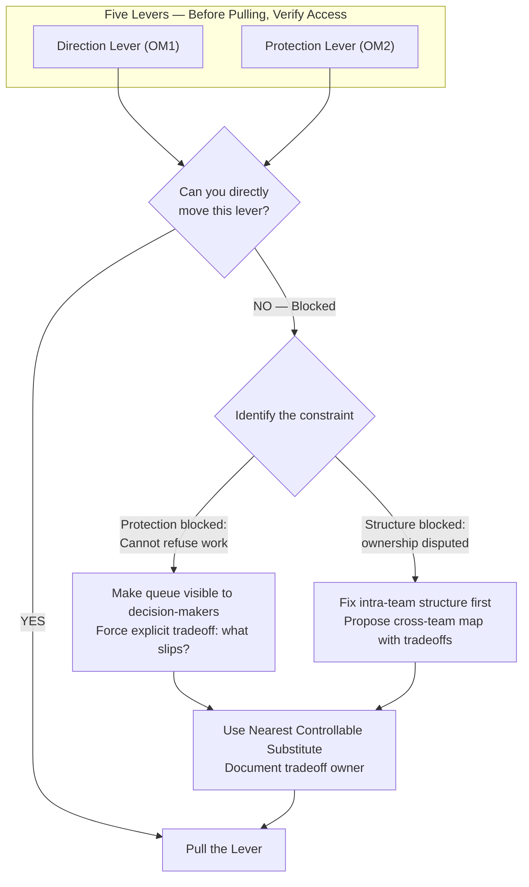

# Lever-Access Rule

## Definition

Before pulling a lever prescribed by the [Fix-Order](fix-order.md) hierarchy, the manager must verify they have the authority (access) to pull it. If a lever is politically or structurally blocked, attempting to pull it will fail silently, creating the illusion that the framework doesn't work.

## Diagram 9: Lever Access and Escalation Map

## Workaround Strategy: The Mechanism Design Solution

Managers in low-authority positions often cannot use the highest-leverage tools (Direction, Protection). The solution requires **credible signaling**:
1. Identify the smallest subsystem where you *do* have authority.
2. Apply the full framework rigorously.
3. Generate quantitative evidence (cycle time ↓ 50%).
4. Use results as bargaining leverage to expand scope.

## The Escalation Rule

If you cannot move a lever, you must **escalate as an explicit tradeoff** and name the tradeoff owner. Do not absorb ambiguity silently. "We can do X by date D, or Y by date D, but not both. Which do you choose?" This forces the decision up to the party blocking the lever.

## Related

- [Fix-Order](fix-order.md) — the diagnostic hierarchy that tells you which lever to pull.
- [Resource Allocation Game](resource-allocation-game.md) — The political dynamics of pulling levers.
