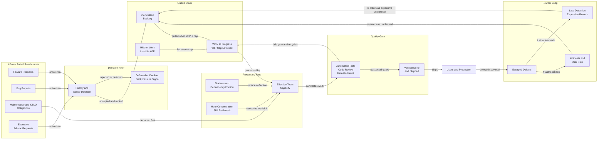

# Little's Law

## Definition

```text
Cycle Time = WIP / Throughput
```

Little's Law is one of the most useful established results in this wiki. In stable flow systems, average cycle time equals average work in progress divided by average throughput.

That makes it more than a framework preference. It is a real observational constraint that repeatedly shows up in software and operations work when the measurement window is chosen carefully.

## Diagram 3: Stock and Flow Physics

This diagram operationalizes Little's Law into a physical model of throughput:



## What This Explains Well

As shown in the diagram, Little's Law is especially useful for understanding:
1. Why rising work in progress tends to lengthen cycle time.
2. Why hidden work breaks apparent control of flow.
3. Why throughput arguments that ignore queue size are often misleading.

It is one of the cleanest ways to translate "too many things at once" into a concrete systems claim.

## Hidden Destroyers in the System

Three hidden elements repeatedly distort the observed flow:
1. Hidden work bypasses stated WIP limits, inflating real queue size.
2. Unbudgeted maintenance acts like a tax on effective processing rate.
3. Late detection creates expensive rework loops that re-enter the queue at the wrong time.

## Boundary Conditions

Little's Law is often misused by applying it without its assumptions in view.

It is strongest when:
1. The system is observed over a meaningful window.
2. Arrival and completion rates are not wildly unstable over that window.
3. Work in progress and done are defined consistently.
4. The queue is actually being measured rather than guessed.

It becomes less informative when teams redefine units constantly, when work items vary wildly in size, or when the observation window is too short and turbulent to represent a meaningful average.

## Relation to Utilization

Little's Law by itself does not say that 85 percent utilization is a universal magic threshold. What it does do is make queue size and waiting time legible. The sharper nonlinear blow-ups near saturation are better explained with utilization curves and queueing sensitivity, as discussed in [Utilization Curve](utilization-curve.md).

## Framework Fit and Correctness Evaluation

> [!CAUTION]
> **Do not force-fit this law into the broader framework.** Little's Law is mathematically cleaner and better established than most of the framework-level equations. It should not be bent to prove the full Systems EM model.

What is fair to say:
1. It strongly supports the claim that excess WIP and hidden queueing lengthen cycle time.
2. It gives a solid base for many flow-management arguments in Block E.
3. It remains observationally useful even when the rest of the framework is only approximate.

What is not fair to say:
1. That Little's Law directly derives the Master Equation.
2. That it fully captures human burnout, skill decay, incentive effects, or political load.
3. That any single queue formula is enough to model a whole sociotechnical system.

In practice, the better stance is: Little's Law is one firm piece of truth that the larger framework should respect, even when the larger framework does not neatly reduce to it.

## Related

- [12 - Block E (Execution System)](12-block-E.md) - where WIP and flow controls live
- [Feedback Speed](feedback-speed.md) - one reason rework loops become expensive
- [Utilization Curve](utilization-curve.md) - queue sensitivity near saturation
- [02 - Master Equation](02-master-equation.md) - broader framework layer that should not over-claim derivation from this law
