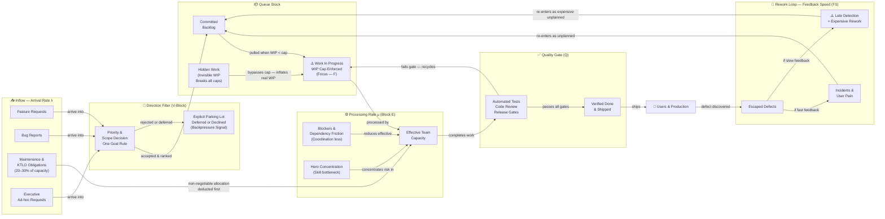

# Little's Law

## Definition

```
Cycle Time = WIP ÷ Throughput
```

A fundamental result from queuing theory applied to engineering workflow: the time any work item spends in the system equals the amount of work in progress divided by the rate at which work completes.

## Diagram 3: Stock and Flow Physics

This diagram operationalizes Little's Law into a physical model of throughput:



## Hidden Destroyers in the System

As shown in Diagram 3, three hidden elements destroy throughput:
1. **Hidden Work:** Bypasses WIP caps, inflating real WIP and multiplying cycle time.
2. **Unbudgeted Maintenance:** Acts as an invisible tax on the processing rate ($\mu$).
3. **Late Detection:** Rework loops have two speeds — fast detection is cheap, slow detection is catastrophic.

## Critical Threshold

When utilization exceeds ~85%, queuing theory predicts **non-linear cycle time growth** — the queue explodes disproportionately. This is why the framework emphasizes slack: operating at 100% utilization is a mathematical guarantee of infinite queue growth. See the [Utilization Curve](utilization-curve.md).

## Framework Fit and Correctness Evaluation

> [!CAUTION]
> **Theoretical Divergence:** Classical queuing theory mathematical models fundamentally fail when applied to human engineering teams without heavy modification.

In classical manufacturing or compute networks, the Processing Rate ($\mu$) is independent of the queue size or utilization (a server processes a packet at a static clock speed regardless of how long the packet waited). 

In the Systems EM framework, **$\mu$ decays as a function of the queue size**. If a team is pushed to 100% utilization, the resulting systemic stress ($Su < 1$) triggers an exponential decay of processing capacity (as defined in the [Transfer Functions](transfer-functions.md)). Human cycles are state-dependent. Therefore, while Little's Law is observationally useful to prove that high WIP equals slow cycle times, it *under-predicts* the severity of the collapse, because it fails to account for the catastrophic burnout of the processing engine itself.

## Related

- [Block E: Focus (F)](12-block-E.md) — the condition that controls WIP
- [Feedback Speed](14-block-L.md) — governs which rework path (fast vs. slow) is triggered
- [Utilization Curve](utilization-curve.md) — The 85% physics limit.
