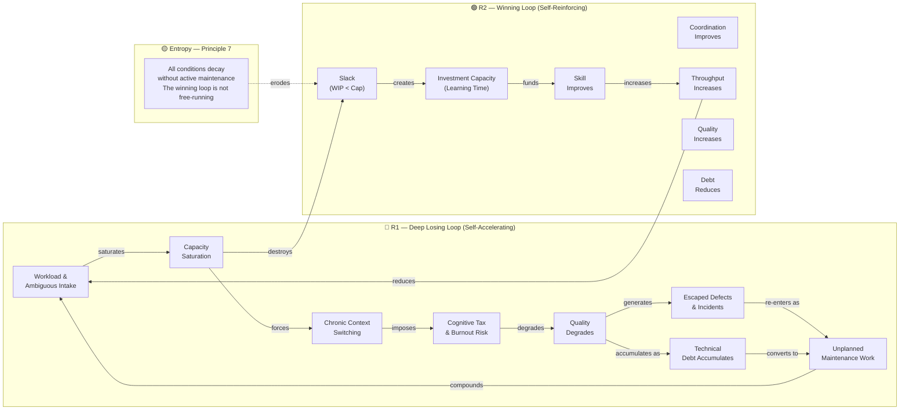

# Losing Loop (R1)

## Definition

A self-reinforcing feedback loop where overload degrades conditions, which generates more work, which increases overload further. Formally labeled **R1** (Reinforcing Loop 1) in the causal loop diagram.

## Diagram 2: Causal Loop Diagram (Structure & Entropy)

The losing loop is structural, not motivational. It operates alongside the Winning Loop (R2) and Manager Balancing Loop (B1).

*Note: For the Manager Balancing arrows, see [Winning Loop](winning-loop.md).*

## Key Properties

- **Self-accelerating:** Once workload exceeds a threshold, the loop accelerates on its own.
- **Two feedback paths:** Quality degradation feeds back through immediate defects/rework AND accumulated tech debt.
- **Entropy (Principle 7):** All conditions decay without active maintenance. The winning loop is not free-running; entropy always pushes the system toward the losing loop.

## Breaking the Loop

Manager interventions (Balancing Loop B1) that break the causal chain:
1. **Direction** (cut scope) — reduces workload at the source.
2. **Protection** (hard WIP cap) — caps saturation.
3. **Ship one complete thing** — restores focus.

## Related

- [Winning Loop](winning-loop.md) — the virtuous counterpart
- [P1-Crisis](p1-crisis.md) — the team state when deeply stuck in this loop
