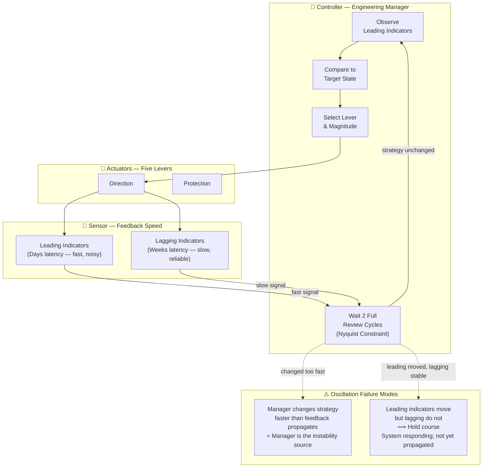

# Nyquist Constraint

## Definition

A principle from signal processing applied to management: **You must sample (measure) at twice the frequency of the system's baseline cycle, and you must not intervene faster than feedback propagates.**

If a manager changes strategy every week but code takes two weeks to deploy, the manager is acting on aliased (lagged) data. 

## Diagram 5: Closed-Loop Control System

## Anti-Pattern

Changing strategy faster than feedback propagates induces **Manager Oscillation**. The manager becomes the primary source of instability in the system.

## Related
- [Metrics Framework](metrics-framework.md) — The leading and lagging indicators measured.
- [Temporal Integration Loop](temporal-integration-loop.md) — Where the Nyquist constraint is executed.
