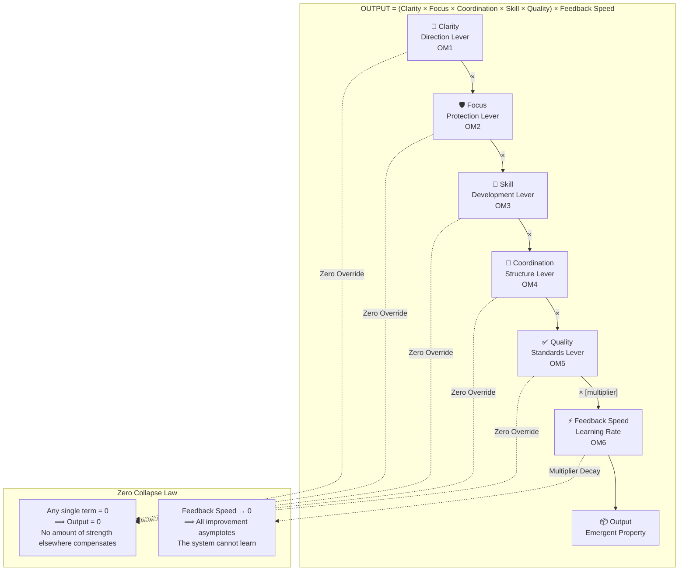

# Master Equation

## The Identity (Original Form)

```
OUTPUT = (Clarity × Focus × Skill × Coordination × Quality) × Feedback Speed
```

## The Refined Equation (with Damping & Latent Variables)

From the [Extended Framework](../sources/3-extended-framework.md), the equation is formalized with time-dependent dynamics, weighted soft zeros, and exponential debt drag:

$$ \text{Output}(t) = \theta \cdot \left[\prod_{i \in \{C,F,S,Co,Q\}} \left(w_i \cdot c_i(t) + (1-w_i)\right)\right] \cdot FS(t) \cdot e^{-\lambda \cdot \text{debt}(t)} $$

Where:
- $\theta$ = team capacity baseline (engineers × hours/sprint)
- $w_i$ = weight of condition $i$ (typically 0.8-1.0 for hard constraints)
- $c_i(t)$ = condition value at time $t$
- $\lambda$ = technical debt decay constant
- $\text{debt}(t)$ = accumulated technical debt

## Dimensional Framework (Measurement Theory)

You cannot manage what you cannot measure. Conditions are latent variables estimated from observable metrics:

| Variable | Dimension | Measurement Proxy |
|----------|-----------|-------------------|
| $C$ (Clarity) | Info Entropy Reduction | $1 - H(goals)/H_{max}$ (e.g., Goal recall rate) |
| $F$ (Focus) | Utilization Efficiency | $1 - (WIP/WIP_{cap})^2$ |
| $S$ (Skill) | Problem-Solving Cap. | Inverse problem resolution time |
| $Co$ (Coordination) | Structural Efficiency | $1 - (blockers \times duration)/total\_work$ |
| $Q$ (Quality) | Defect Prevention Rate | $1 - (escaped\_defects/total\_releases)$ |
| $FS$ (Feedback Speed) | Learning Multiplier | $baseline\_cycle / current\_cycle$ |

## Visual Architecture: Diagram 1 (Zero Collapse)



## Why Multiplicative (Not Additive)

The multiplicative structure encodes a critical insight: **a zero in any single condition drives the entire product to zero**, regardless of how strong the other conditions are. 

## Related

- [Zero-Override Rule](../concepts/zero-override-rule.md) — operational consequence of multiplicative structure
- [Losing Loop](../concepts/losing-loop.md) / [Winning Loop](../concepts/winning-loop.md)
- [Order Parameter](../concepts/order-parameter.md) — The sum $\Phi$ defining state transitions.
