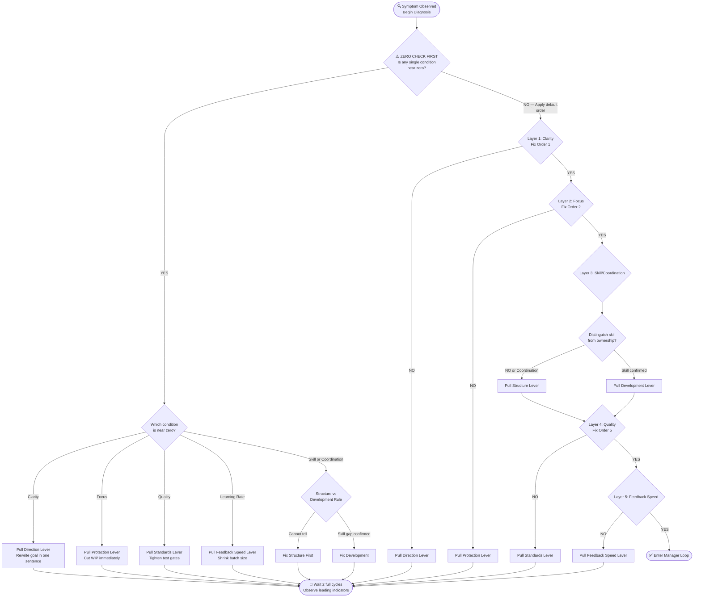

# Table 2 — Diagnostics

## Purpose

Table 2 is the diagnostic engine of the framework. It maps **observed symptoms** to **root cause diagnoses** and prescribes the correct **lever** to pull, in what order.

## Diagram 6: The Complete Diagnostic Decision Tree

This diagram encodes the executable logic of Table 2:

## Diagnostic Rows (Reference)

| ID | Symptom | Root Cause | Lever | Fix Order |
|---|---|---|---|---|
| D1 | People confused about what to build | Direction failure (Clarity ≈ 0) | Direction | 1 |
| D3 | Lots started, little finished | Flow failure (Focus ≈ 0) | Protection | 2 |
| D5 | Engineers stuck on technical problems | Capability failure (Skill ≈ 0) | Development | 3 |
| D6 | Work collides, duplicates, or has gaps | Coordination failure | Structure | 4 |
| D7 | Bugs reaching users, unstable releases | Quality failure (Standards ≈ 0) | Standards | 5 |

## Embedded Rules

- **[Zero-Override Rule](../concepts/zero-override-rule.md):** If any condition is near zero, fix it first regardless of the fix-order hierarchy.
- **[Structure-vs-Development Rule](../concepts/structure-vs-development-rule.md):** When you can't tell if a problem is skill or coordination, fix Structure first.

## Related

- [Fix-Order Decision Tree](../concepts/fix-order.md) — visual flowchart of Table 2 logic
- [Master Equation](master-equation.md) — the equation whose terms Table 2 diagnoses
